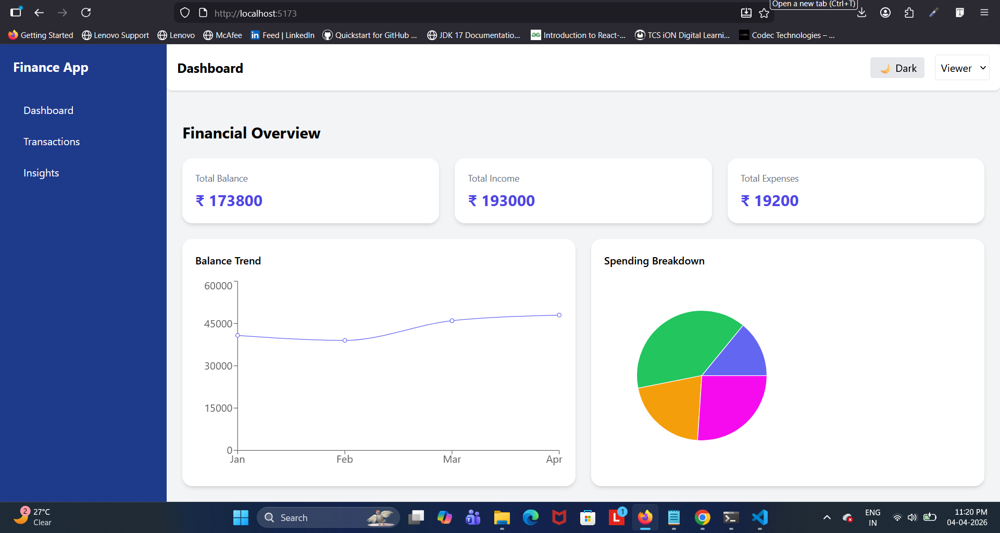
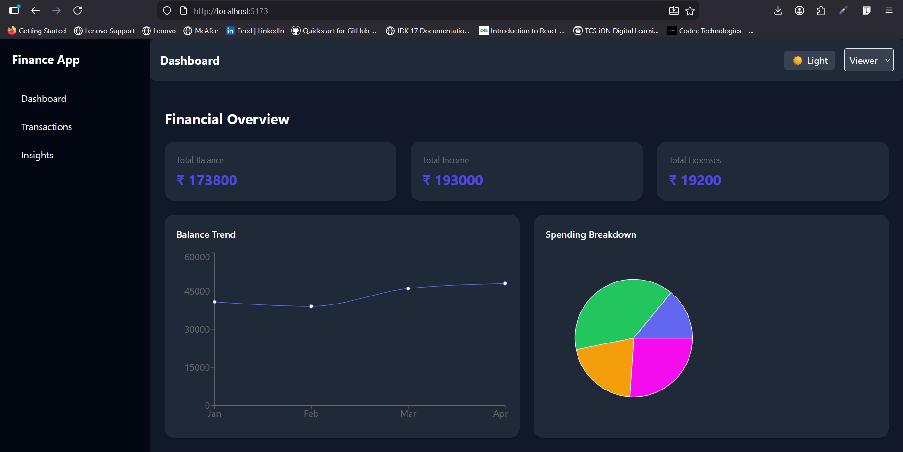
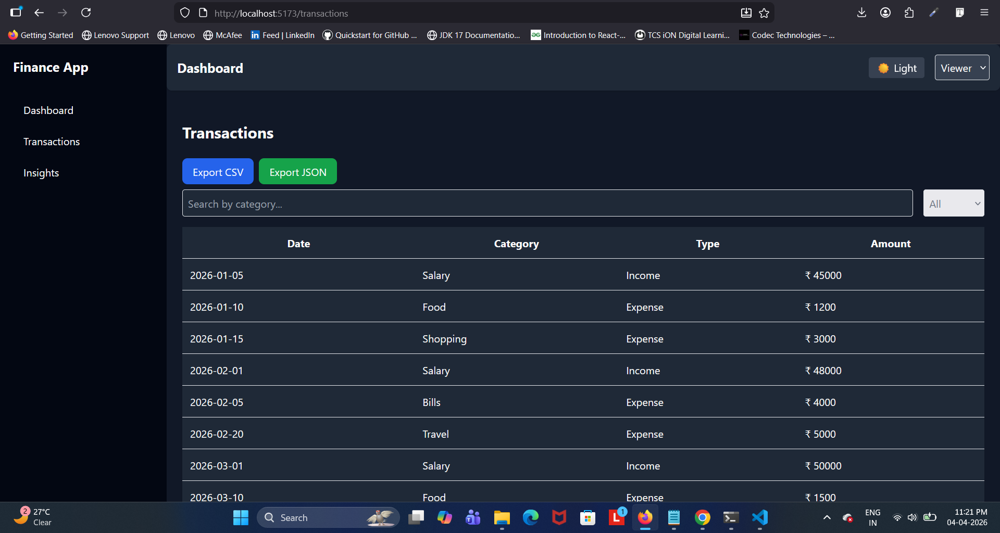
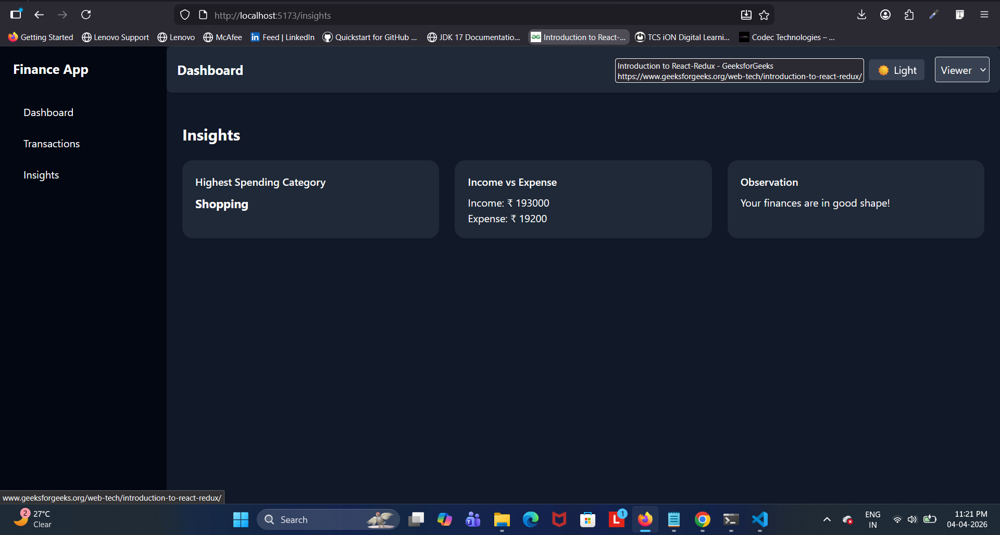

# 💰 Finance Dashboard UI

A modern and responsive Finance Dashboard built using **React.js** and **Tailwind CSS**.
This project allows users to track their financial activity, analyze spending patterns, and manage transactions with a clean UI.

---

## 🚀 Features

### 📊 Dashboard Overview

* View total balance, income, and expenses
* Interactive charts:

  * Balance trend (time-based)
  * Spending breakdown (category-based)

### 💳 Transactions Management

* View all transactions with:

  * Date
  * Category
  * Type (Income/Expense)
  * Amount
* Features:

  * Search & filtering
  * Delete transactions
  * Sort data

### 👤 Role-Based UI

* **Viewer** → Can only view data
* **Admin** → Can add/delete transactions
* Role switching using dropdown

### 📈 Insights Section

* Highest spending category
* Income vs Expense comparison
* Smart financial observation

---

## 🌙 Optional Enhancements

* 🌙 Dark Mode (with persistence)
* 💾 Local Storage (data saved in browser)
* 📤 Export Transactions (CSV & JSON)
* 📱 Responsive Design
* ✨ Smooth UI transitions

---

## 🛠️ Tech Stack

* **React.js**
* **Vite**
* **Tailwind CSS**
* **Context API** (State Management)
* **Recharts** (for charts)

---

## 📂 Project Structure

```
src/
│
├── components/
│   ├── Dashboard/
│   ├── Layout/
│   ├── UI/
│
├── context/
│   └── FinanceContext.jsx
│
├── data/
│   └── mockData.js
│
├── pages/
│   ├── Dashboard.jsx
│   ├── Transactions.jsx
│   ├── Insights.jsx
│
├── utils/
│   └── helpers.js
│
└── App.jsx
```

---

## ⚙️ Installation & Setup

```bash
# Clone the repository
git clone https://github.com/Anuja-Suryawanshi07/finance-dashboard-ui.git

# Navigate into the project
cd finance-dashboard-ui

# Install dependencies
npm install

# Run the development server
npm run dev
```

---

## 📸 Screenshots

### 📊 Dashboard

### 🌙 Dark Mode

### 💳 Transactions

### 📈 Insights


---

## 🧠 Learning Outcomes

* Built reusable UI components using React
* Managed global state using Context API
* Implemented dark mode using Tailwind CSS
* Worked with charts and data visualization
* Implemented local storage for persistence
* Built real-world features like export functionality

---

## 💼 Why This Project?

This project demonstrates:

* Strong frontend fundamentals
* Clean UI/UX design
* Real-world problem solving
* Beginner-friendly yet practical implementation

---

## 📌 Future Improvements

* Edit transaction feature
* Backend integration (Node.js / Express)
* Authentication system
* Advanced analytics

---

## 🙌 Acknowledgements

This project was built as part of frontend learning and practice.

---

## ⭐ Show Your Support

If you like this project, give it a ⭐ on GitHub!
